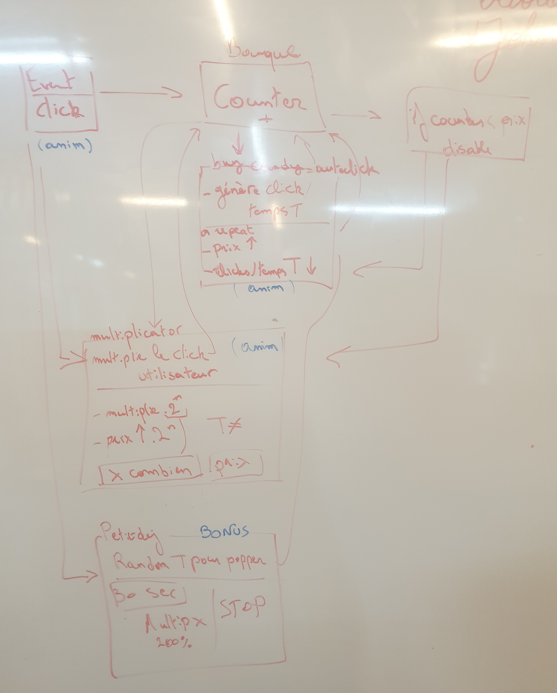

# Johnson Foodfest Cookie Clicker!

## Aim and vibe
Do you like food? We in the Becode class of Johnson sure do!<a href="https://arnaud-vanderschriek.github.io/cookie-clicker/"> This cookie clicker</a> is a game that we dedicate to the love of chocolate of some of us and to our regular gargantuous class breakfasts. 

We had two days to make this game as part of our learning traject in BeCode. This was made after 1 month (our class started on 23 August 2019).

Collaborators were Arnaud V., Octavia C., and Jeremy D.

## To do

The game had to contain a number of elements. They are:
<ul>
<li>An autoclicker: these can be bought for an incremental number of clicks. In our game these are the candy canes</li>
<li>A multiplier bonus: in our game it became a small dedication to our beloved coach's love of chocolate. Those are also bought with clicks for a steadily raising price.</li>
<li>A boost: we decided to go not for a buyable boost but for one that is generated at random. A cook will pop up when you can click the "breakfast frenzy" button.</li>
</ul>

## Planning

The first step was getting a good idea of how to construct the game. We worked on a whiteboard to get a schematic understanding of the game. 

 

The second step was making a mockup of out pages. 

Day 1 (24 September 2019) : created mockup, planning, first draft of the html and css. We worked in pair programming for the first draft of the html and javascript. In the evening Jeremy D. created the images except the main muffin and the background.
Day 2 (25 September 2019) : the html and css was further refined by Arnaud, Jeremy and Octavia finished the javascript. By the end of the day the group pulled together and ironed out the last details together.
